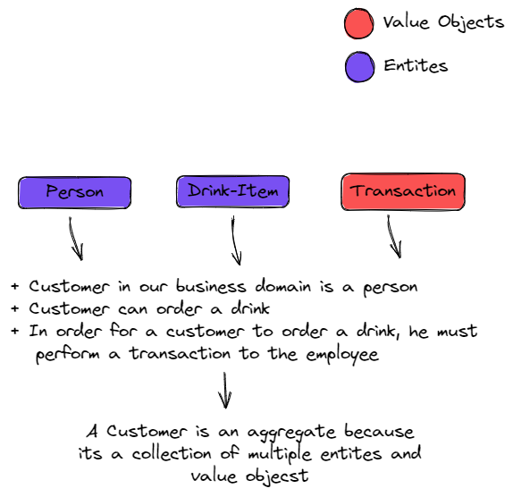

# online-tavern-DDD

# The business

➜ In this project I am trying to build an online tavern  
➜ The core-domain is the tavern itself 
➜ The sub-domains are [Customer], [Employee], [Financial], [Suppliers] 

# DDD structure

### **Entity**

➜ Entity is the placeholder for a domain/sub-domain model which is used to keep information about the data 
➜ Entity is identified by an ID 
➜ Entity is mutable and it can be modified from other domains  
➜ Same entity can be used in multiple sub-domains, thats why I decided to create a separate package for the `En tities` and not define my entities inside the domain package 

### **Value-Object**

➜ Value object is immutable, and it has no identifier, its a representation for a data and once its created it can't be modified, if you need to update the data, you must delete it and create a new value object 
➜ `Transaction` is a value object in my project, so I implemented its fields with lowercase because I won't allow any sub-domain to mutate it 

### **Aggregates**

➜ Aggregate is used to represent the concepts about my domain that can't be representeed by a single entity or value-objects, for example the `customer` is a `person` and `customer` can buy a `product` and also `customer` can perform `transaction`  
➜ Aggregate's data shouldn't be exposed outside the aggregate to other sub-domains, thats why I decided to keep its paramters as lowercase defined.

### **Factory Pattern ?**

➜ I used the factory pattern because its used to encapsulate a complex business logic inside functions for creating domain instances without needing from the client-code to know anything about the actual implementation details.

# Application Structure & Design Decisions

### Repository

➜ Repository is responsible of managing one aggregate.
➜ Its best practise to loosly couple your repos, so one repo manage one aggregate.

### Services

➜ Serivce is responsible of coupling/gathering the loosly coupled repositories togeather to fullfill the business need
